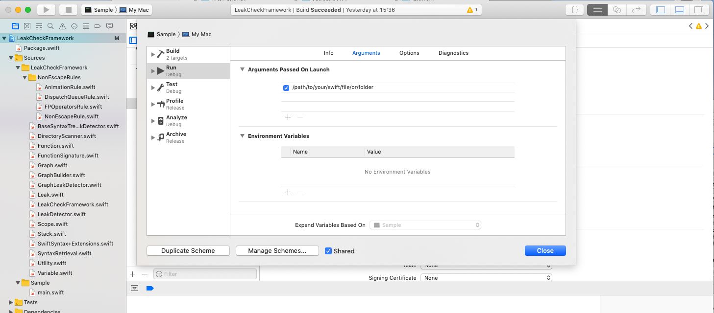

# Swift Leak Checker

A tool that can detect potential memory leak caused by strongly captured `self` in `escaping` closure


# Example

Some examples of memory leak that are detected by the tool:

```swift
class X {
  private var handler: (() -> Void)!
  
  func setup() {
    handler = {
      self.doSmth() // <- Leak
    }
    
    anotherHandler = { // Outer closure
      doSmth { [weak self] in // <- Leak
        // .....    
      }
    }
  }
}
```

For first leak, `self` holds a strong reference to `handler`, and `handler` holds a strong reference to `self`, which completes a retain cycle.

For second leak, although `self` is captured weakly by the inner closure, but `self` is still implicitly captured strongly by the outer closure, which leaks to the same problem as the first leak


# Usage

There're 2 ways to use this tool: the fastest way is to use the provided SwiftLeakChecker target and start detecting leaks in your code, or you can drop the SwiftLeakCheck framework in your code
and start building your own tool

### SwiftLeakChecker

There is a SwiftLeakChecker target that you can run directly from XCode or as a command line. 

**To run from XCode:**

Edit the `SwiftLeakChecker` scheme and change the `/path/to/your/swift/file/or/folder` to an absolute path of a Swift file or directory. Then hit the `Run` button (or `CMD+R`)




**To run from command line:**

```
./SwiftLeakChecker path/to/your/swift/file/or/folder
```

### Build your own tool

The SwiftLeakChecker target is ready to be used as-is. But if you want to build your own tool, do more customisation etc.., then you can follow these steps.

Note: Xcode 10.2 or later or a Swift 4.2 toolchain or later with the Swift Package Manager is required.


Add this repository to the `Package.swift` manifest of your project:

```swift
// swift-tools-version:4.2
import PackageDescription

let package = Package(
  name: "MyAwesomeLeakDetector",
  dependencies: [
    .package(url: "This repo .git url", .exact("package version")),
  ],
  targets: [
    .target(name: "MyAwesomeLeakDetector", dependencies: ["SwiftLeakCheck"]),
  ]
)
```

Then, import `SwiftLeakCheck` in your Swift code

To create a leak detector and start detecting: 

```swift
import SwiftLeakCheck

let url = URL(fileURLWithPath: "absolute/path/to/your/swift/file/or/folder")
let detector = GraphLeakDetector()
let leaks = detector.detect(url)
leaks.forEach { leak in
  print("\(leak)")
}
```

# Leak object

Each `Leak` object contains `line`, `column` and `reason` info.
```
{
  "line":41,
  "column":7,
  "reason":"`self` is strongly captured here, from a potentially escaped closure."
}
```

# CI and Danger

The image on top shows a leak issue that was reported by our tool running on Gitlab CI. We use [Danger](https://github.com/danger/danger) to report the `line` and `reason` of every issue detected.


# How it works

We use [SourceKit](http://jpsim.com/uncovering-sourcekit) to get the [AST](http://clang.llvm.org/docs/IntroductionToTheClangAST.html) representation of the source file, then we travel the AST to detect for potential memory leak. 
Currently we only check if `self` is captured strongly in an escaping closure, which is one specific case that causes memory leak

To do that, 3 things are checked:

**1. Check if a reference captures `self`**

```swift
block { [weak self] in
  guard let strongSelf = self else { return }
  let x = SomeClass()
  strongSelf.doSmth { [weak strongSelf] in
    guard let innerSelf = strongSelf else { return }
    x.doSomething()
  }
}
```

In this example, `innerSelf` captures `self`, because it is originated from `strongSelf` which is originated from `self`

`x` is also a reference but doesn't capture `self`

**2. Check if a closure is non-escaping**

We use as much information about the closure as possible to determine if it is non-escaping or not.

In the example below, `block` is non-escaping because it's not marked as `@escaping` and it's non-optional
```
func doSmth(block: () -> Void) {
   ... 
}
```

Or if it's anonymous closure, it's non-escaping
```swift
let value = {
  return self.doSmth()
}()
```

We can check more complicated case like this:

```swift
func test() {
  let block = {
    self.xxx
  }
  doSmth(block)
}
func doSmth(_ block: () -> Void) {
  ....
}
```

In this case, `block` is passed to a function `doSmth` and is not marked as `@escaping`, hence it's non-escaping

**3. Whether an escaping closure captures self stronlgy from outside**

```swift
block { [weak self] in
  guard let strongSelf = self else { return }
  self?.doSmth {
    strongSelf.x += 1
  }
}
```

In this example, we know that:
1. `strongSelf` refers to `self`
2. `doSmth` is escaping (just for example)
3. `strongSelf` (in the inner closure) is defined from outside, and it captures `self` strongly


# False-positive alarms

### If we can't determine if a closure is escaping or non-escaping, we will just treat it as escaping. 

It can happen when for eg, the closure is passed to a function that is defined in other source file.
To overcome that, you can define custom rules which have logic to classify a closure as escaping or non-escaping.


# Non-escaping rules

By default, we already did most of the legworks trying to determine if a closure is non-escaping (See #2 of `How it works` section)

But in some cases, there's just not enough information in the source file. 
For eg, we know that a closure passed to `DispatchQueue.main.async` will be executed and gone very soon, hence it's safe to treat it as non-escaping. But the `DispatchQueue` code is not defined in the current source file, thus we don't have any information about it.

The solution for this is to define a non-escaping rule. A non-escaping rule is a piece of code that takes in a closure expression and tells us whether the closure is non-escaping or not.
To define a non-escaping rule, extend from `BaseNonEscapeRule`  and override `func isNonEscape(arg: FunctionCallArgumentSyntax,....) -> Bool`

Here's a rule that matches `DispatchQueue.main.async` or `DispatchQueue.global(qos:).asyncAfter` :

```swift
open class DispatchQueueRule: NonEscapeRule {
  
  open override isNonEscape(arg: FunctionCallArgumentSyntax?, funcCallExpr: FunctionCallExprSyntax,, graph: Graph) -> Bool {
    // Signature of `async` function
    let asyncSignature = FunctionSignature(name: "async", params: [
      FunctionParam(name: "execute", isClosure: true)
    ])
    
    // Predicate to match DispatchQueue.main
    let mainQueuePredicate = ExprSyntaxPredicate.memberAccess("main", base: ExprSyntaxPredicate.name("DispatchQueue"))
    
    let mainQueueAsyncPredicate = ExprSyntaxPredicate.funcCall(asyncSignature, base: mainQueuePredicate)
    if funcCallExpr.match(mainQueueAsyncPredicate) { // Matched DispatchQueue.main.async(...)
        return true
    }
    
    // Signature of `asyncAfter` function
    let asyncAfterSignature = FunctionSignature(name: "asyncAfter", params: [
      FunctionParam(name: "deadline"),
      FunctionParam(name: "execute", isClosure: true)
    ]) 
    
    // Predicate to match DispatchQueue.global(qos: ...) or DispatchQueue.global()
    let globalQueuePredicate = ExprSyntaxPredicate.funcCall(
      FunctionSignature(name: "global", params: [
        FunctionParam(name: "qos", canOmit: true)
        ]),
      base: ExprSyntaxPredicate.name("DispatchQueue")
    )
    
    let globalQueueAsyncAfterPredicate = ExprSyntaxPredicate.funcCall(asyncAfterSignature, base: globalQueuePredicate)
    if funcCallExpr.match(globalQueueAsyncAfterPredicate) {
        return true
    }
    
    // Doesn't match either function
    return false
  }
}
```

Here's another example of rule that matches `UIView.animate(withDurations: animations:)`:

```swift
open class UIViewAnimationRule: BaseNonEscapeRule {
  open override func isNonEscape(arg: FunctionCallArgumentSyntax?, funcCallExpr: FunctionCallExprSyntax, graph: Graph) -> Bool {
    let signature = FunctionSignature(name: "animate", params: [
      FunctionParam(name: "withDuration"),
      FunctionParam(name: "animations", isClosure: true)
      ])
    
    let predicate = ExprSyntaxPredicate.funcCall(signature, base: ExprSyntaxPredicate.name("UIView"))
    return funcCallExpr.match(predicate)
  }
}
```

After creating the non-escaping rule, pass it to the leak detector:

```swift
let leakDetector = GraphLeakDetector(nonEscapingRules: [DispatchQueueRule(), UIViewAnimationRule()])
```

# Predefined non-escaping rules

There're some ready-to-be-used non-escaping rules:

**1. DispatchQueueRule**

We know that a closure passed to `DispatchQueue.main.async` or its variations is escaping, but the closure will be executed very soon and destroyed after that. So even if it holds a strong reference to `self`, the reference
will be gone quickly. So it's actually ok to treat it as non-escaping

**3. UIViewAnimationRule**

UIView static animation functions. Similar to DispatchQueue, UIView animation closures are escaping but will be executed then destroyed quickly.

**3. UIViewControllerAnimationRule**

UIViewController's present/dismiss functions. Similar to UIView animation rule.

**4. CollectionRules**

Swift Collection map/flatMap/compactMap/sort/filter/forEach. All these Swift Collection functions take in a non-escaping closure

# Write your own detector

In case you want to make your own detector instead of using the provided GraphLeakDetector, create a class that extends from `BaseSyntaxTreeLeakDetector` and override the function

```swift
class MyOwnLeakDetector: BaseSyntaxTreeLeakDetector {
  override func detect(_ sourceFileNode: SourceFileSyntax) -> [Leak] {
    // Your own implementation
  }
}

// Create an instance and start detecting leaks
let detector = MyOwnLeakDetector()
let url = URL(fileURLWithPath: "absolute/path/to/your/swift/file/or/folder")
let leaks = detector.detect(url)
```


### Graph

Graph is the brain of the tool. It processes the AST and give valuable information, such as where a reference is defined, or if a closure is escaping or not. 
You probably want to use it if you create your own detector:

```swift
let graph = GraphBuilder.buildGraph(node: sourceFileNode)
```


# Note

1. To check a source file, we use only the AST of that file, and not any other source file. So if you call a function that is defined elsewhere, that information is not available.

2. For non-escaping closure, there's no need to use `self.`. This can help to prevent false-positive


# License

This library is available as open-source under the terms of the [MIT License](https://opensource.org/licenses/MIT).


